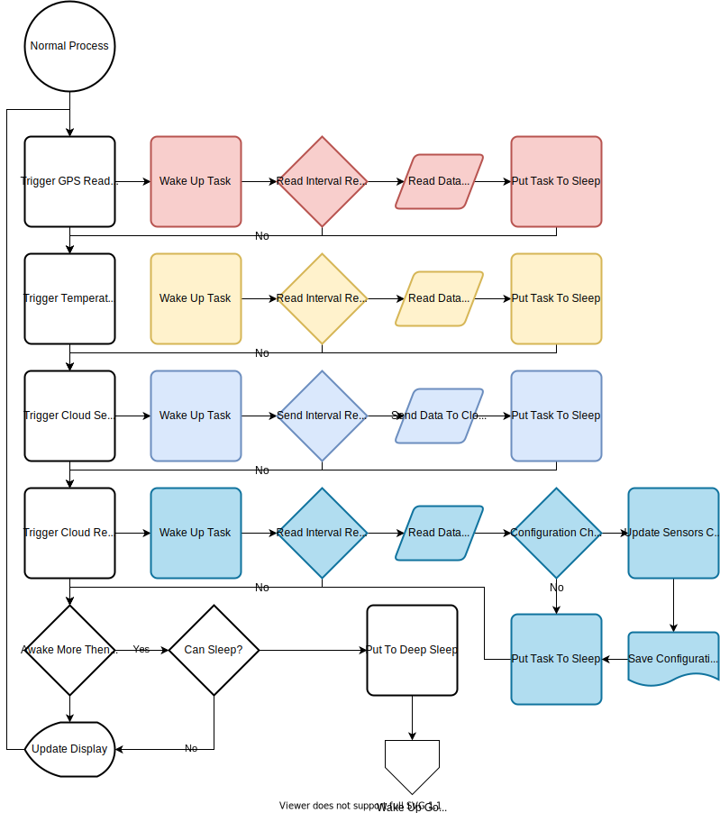

# Device Firmware Processing

This blog will outline the firmware development and how it work on the ESP32 device.  We will be developing the firmware using [Arduino](https://arduino.cc) open-source electronics platform, using [Platform.io](https://platform.io/) as the development platform.

## Startup Process

### WPS Mode

The device will automatically switch to WPS mode under the following conditions.

1. Never linked to a router before
1. Cannot find previous router
1. Cannot connect in a timely manner to an existing router

It will display give a count of seconds it has waited for, it only give this count if waiting for WPS mode.  The user will then be able to press the routers WPA button and reset the ESP32 to try again.  During testing I have noticed it asks for WPA 1 in 10 resets.  I had to just reset it again to connect automatically.  

>__*I leave it up to the reader to add the code to automatically reset if it detects that the router's SSID is detected and within range (DB Strength).*__

### Configuration File

The ESP 32 device has the ability to store files in the flash area of memory.  It is basically a file system.  It is explained in the [SPIFF](https://docs.espressif.com/projects/esp-idf/en/latest/esp32/api-reference/storage/spiffs.html) documentation by [Espressif](https://www.espressif.com/), who manufacturer and develop this range of SOC microcontroller.

I am using [JSON](https://www.json.org/json-en.html) file layout for the configuration.  I know its not the most efficient file structure, but it is easy to read and modify by a human.

See [Device Sensor Configuration](./DeviceConfigSetup.md) for full details.

## Normal Process

The flows that are coloured are running on core 0 and are independent of each other.  This will use the FreeRTOS [xTaskCreatePinnedToCore](https://docs.espressif.com/projects/esp-idf/en/latest/esp32/api-reference/system/freertos.html) function for creating tasks with specific affinity and assign them to a specific processor core.  In this case core 0.  Everything else runs on Core 1.  This is Arduino default core.
