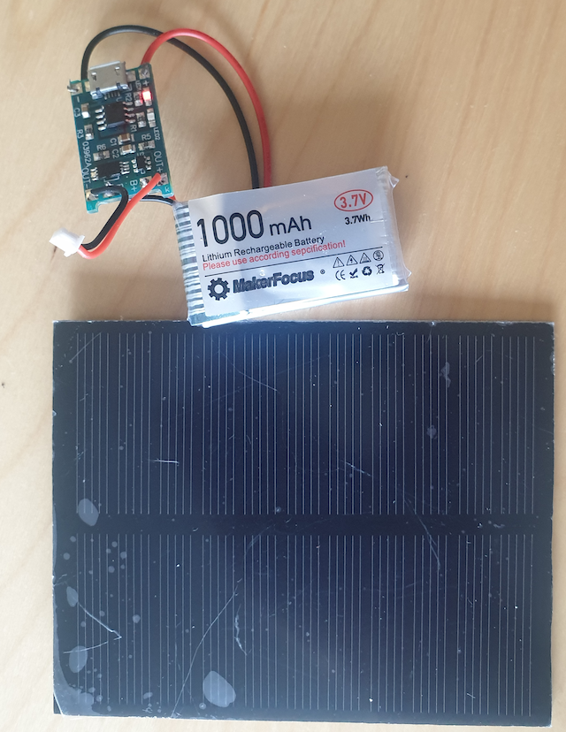
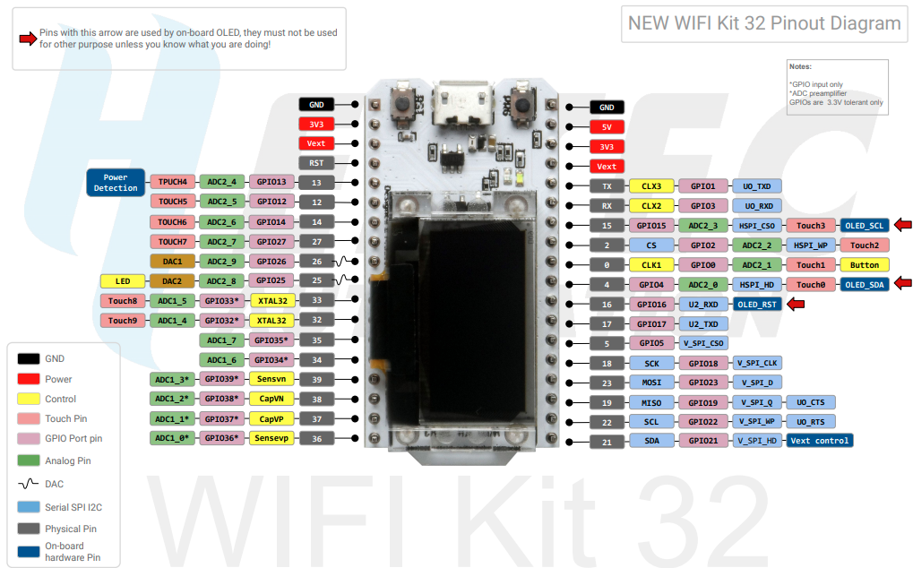

# Device and Sensors Setup

We are going to create a device from the following components.  Links will redirect you to Amazon website for the UK.  You will have to convert to your own region Amazon or use related website for the components.  

* [ESP32 Development board](https://www.amazon.co.uk/gp/product/B076P8GRWV/ref=ppx_od_dt_b_asin_title_s00?ie=UTF8&psc=1)
* [GPS NEO-6M](https://www.amazon.co.uk/gp/product/B01N38EMBF/ref=ppx_od_dt_b_asin_title_s01?ie=UTF8&psc=1)
* [U.FL Mini PCI to SMA Female](https://www.amazon.co.uk/gp/product/B01LPXGJ2I/ref=ppx_yo_dt_b_asin_title_o02_s01?ie=UTF8&psc=1)
* [GPS External Ariel SMA](https://www.amazon.co.uk/Waterproof-Active-Antenna-28dB-Gain-Black/dp/B00LXRQY9A/ref=sr_1_5?dchild=1&keywords=gps+antenna&qid=1597056498&sr=8-5)
* [DSD Tech DHT22](https://www.amazon.co.uk/gp/product/B07CM2VLBK/ref=ppx_yo_dt_b_asin_title_o03_s00?ie=UTF8&psc=1)

The _**GPS External Ariel/5 U.FL Mini PCI to SMA Female**_ is really only needed if you want to program the device inside a warm environment or not.  I know you can sometimes get a satellite lock indoors, but its not reliable as you need line of sight for this lock.

The MT3608 is required because the GPS wants 5v power, and during the testing on battery the 5v line from the ESP32 was 1.75v, so not enough power being generated.  

I have added in 3 LED's to show power on, wifi connected and sending/receiving data to/from the cloud.

The OLED display on the ESP32 board will display information on startup and normal mode.

## External Power

If we have time at the end I will show how we could connect the following

* [Lithium Recharge Battery](https://www.amazon.co.uk/gp/product/B07CYMYMS9/ref=ppx_yo_dt_b_asin_title_o02_s00?ie=UTF8&psc=1)
* [Solar Panel](https://smile.amazon.co.uk/gp/product/B01AFKP7UC/ref=ppx_yo_dt_b_asin_title_o00_s00?ie=UTF8&psc=1)
* [Li-ion Charging Module TP4056 + DW01](https://smile.amazon.co.uk/gp/product/B07GDRNDMS/ref=ppx_yo_dt_b_asin_title_o00_s01?ie=UTF8&psc=1)
* [MT3608 Step-Up Adjustable DC-DC](https://smile.amazon.co.uk/gp/product/B07MY3NZ18/ref=ppx_yo_dt_b_asin_title_o00_s00?ie=UTF8&psc=1)

The EPS32 Development board accepts 5v via the USB connector, but the battery connector underneath only seems to accept the 3.7v from the Lithium battery.  This is a problem in that the GPS needs between 3.3v and 5v, closer to 5v the better to get a satellite fix.  The ESP32 board has an onboard voltage regulator, so we don't need to worry about frying the ESP32 chip itself and I think this is where we run into difficulties.  Still waiting for information from the manufacturer about the 3.3v and 5v power pins and acceptable power inputs.  The power pins do not switch off when you tell the ESP32 chip to go to deep sleep.  I think this will end up being a separate blog.

## Building The System

I have already pre-soldered ESP32 Development board.  From the photos you can see I am not that good at soldering.

I have built/soldered the solar panel, TP4056 and battery together.

The following circuit diagram will help with the connecting of pins.

The pin numbers are the physical pin layout on the board.  The configuration settings uses logical pin layout, see the table in the diagram.  

### Battery Connected Issue

There is an issue in that when the lithium battery is connected the device will stay switched on.  This will not be too much of issue when we have the full firmware loaded as it will automatically go to deep sleep (switched off) after an idle period.  The real issue is if you connect the battery up before connecting all the sensors etc you may short circuit something and then damage the sensor, or the development board.

The process to connect up the sensors, ESP32 development board and battery will be outline below.

### Testing LED

The LED has a negative and positive leg.  Its important that you get them the right way around or else at best it does not light up or worst you will blow it.  Not seen them blown up with these types of setups, but if you apply enough voltage they can. Generally the short leg is the negative and the long leg is positive.  If you have cut the legs to fit a circuit, how can you tell.  The best way I have found is using a multimeter. They generally have a diode tester option, well thats what I call it, I bet someone will correct me here.

Connect the negative and positive probes and the LED should light up.  Switch the probes around if not.  Now you know which side is the negative.

> On a side note, the resistor value is 330ohms used for each LED.  This may not be correct depending on the LED colour value, but should not any real problem.  The main problem will be that the LED will not be bright as it could be.  For brightness control, the GPIO pins should support analog mode.

### Wiring The Sensors

#### Step 1

Now using a breadboard, I have added pre-cut wires and sensors to it.  These can be sourced from Amazon as well. You will notice that the wire colours are different to the circuit diagram.  The pre-cut wires are a jumpable of colours, so I have used wire that have the correct length or nearest correct length.  Then worry about the colours later.

#### Step 2

Now press in the ESP32 WiFi board into the breadboard.  Be very careful here, as pressing down too hard on the display edge will break it.  I have done this once!

Once the external ariel is connected and end of the GPS Antenna is placed outside, or has a direct line of sight to the sky.  Make sure if you have double glazing, this can cause interference as well, open up the window if you can.
