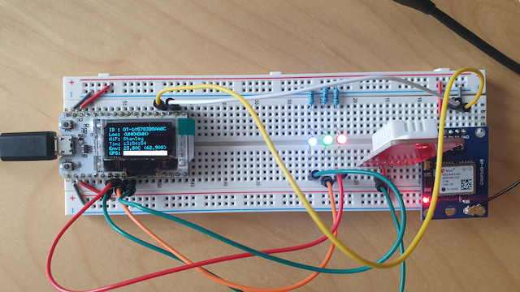

# Firmware Development

I will not be going thought the firmware line by line as that will be boring.  I will leave it up to you to decide you wish to do that.  Instead I will go through the why of each library and what to look out for.  By the time these blogs are published I will have commented each library and give some examples where I think the code is not clear enough.

## Platform IO - Non-standard

If you open up the `platformio.ini` file in the root of the github repo you will notice this sections

```ini
[platformio]
data_dir = firmware/data
src_dir = firmware/src
include_dir = firmware/include
lib_dir = firmware/lib
```

Normally, this would not be included.  As I will be including multiple different sources in this repo, generally just to keep them all self contained, I have add it in.  

For general development practices, each app, program, website, documentation would have its own repo to build from.  This will be covered in the [CI/CD Pipelines](./CICDPipeLines.md) blog.

I have added in following to the project section of the `platform.ini` file.

```ini
upload_port = /dev/cu.SLAB_USBtoUART
monitor_port = /dev/cu.SLAB_USBtoUART
```

This is because I have multiple USB ports on my Mac and don't want to have to specify which port to use when I upload to the device or use the monitoring.  You can either remove these entries or update them to your USB port identifier.  

> I have noticed on Windows platform the COM port identifier increments if it things the port is in use between uploads at random times.  This may have been a quirk on my system.

## Multiple Threads/Tasks

The ESP32 device have 2 cores, this allows for multiple processes/task to be performed at once.  The timing is will be issue here with the possible race conditions that could follow, like reading of pins that share the same hardware interrupts. With that being said some of tasks will take Mutex before beginning checking the sensor and then hand back the Mutex when finished.  

Not all tasks will require to be ran on core 0 either.  We will see what the balance is like during the development.  Currently thinking that the check for cloud messages can be ran on the core 1, along with the other standard functions for display and loop functions.

## Libraries

The firmware will use a mix of libraries from 3rd party or ones we will make.  

All 3rd party libraries are registered in the `platformio.ini` file, in the `lib_deps` setting.

All developed libraries are in the `lib` folder.  By the time this published you should find the following in each sub folder.  The `.cpp` and `.h` files that contain the library and a `readme.md` that will explain it.

## Development IDE

The recommended IDE from Platform.io is to use [Visual Studio Code](https://code.visualstudio.com/download) and use the [PlatformIO IDE](https://marketplace.visualstudio.com/items?itemName=platformio.platformio-ide) extension.  Personally I have a lot more extensions added for cloud interaction, formatting, docker/containers etc.

This is a great open source IDE.  It can be a bit limiting sometimes, depends on the language you are using.  

With the `PlatformIO` extension install you should see the following navigation icon in the `Activity Bar`


When selected you should see the following in the `Sidebar`


The important options are as follows.

### Build

Used to test compilation locally really.

```shell
Processing heltec-wifi-esp32 (platform: espressif32; board: heltec_wifi_kit_32; framework: arduino)
-----------------------------------------------------------------------------------------------------
Verbose mode can be enabled via `-v, --verbose` option
CONFIGURATION: https://docs.platformio.org/page/boards/espressif32/heltec_wifi_kit_32.html
PLATFORM: Espressif 32 1.12.4 > Heltec WiFi Kit 32
HARDWARE: ESP32 240MHz, 320KB RAM, 4MB Flash
DEBUG: Current (esp-prog) External (esp-prog, iot-bus-jtag, jlink, minimodule, olimex-arm-usb-ocd, olimex-arm-usb-ocd-h, olimex-arm-usb-tiny-h, olimex-jtag-tiny, tumpa)
PACKAGES:
 - framework-arduinoespressif32 3.10004.200129 (1.0.4)
 - tool-esptoolpy 1.20600.0 (2.6.0)
 - toolchain-xtensa32 2.50200.80 (5.2.0)
LDF: Library Dependency Finder -> http://bit.ly/configure-pio-ldf
LDF Modes: Finder ~ chain, Compatibility ~ soft
Found 53 compatible libraries
Scanning dependencies...
Dependency Graph
|-- <ArduinoJson> 6.16.0
... Dependency Graph
|-- <SPIFFS> 1.0
|   |-- <FS> 1.0
Building in release mode
Compiling .pio/build/heltec-wifi-esp32/src/main.cpp.o
... compile and archiving list
Linking .pio/build/heltec-wifi-esp32/firmware.elf
Building .pio/build/heltec-wifi-esp32/firmware.bin
Retrieving maximum program size .pio/build/heltec-wifi-esp32/firmware.elf
Checking size .pio/build/heltec-wifi-esp32/firmware.elf
Advanced Memory Usage is available via "PlatformIO Home > Project Inspect"
RAM:   [=         ]  14.2% (used 46400 bytes from 327680 bytes)
Flash: [========  ]  79.2% (used 1037650 bytes from 1310720 bytes)
esptool.py v2.6
=========== [SUCCESS] Took 15.98 seconds ==============
```

### Upload

Used to flash the device of the compiled code.  It will detect if needs compilation again if required.

```shell
Processing heltec-wifi-esp32 (platform: espressif32; board: heltec_wifi_kit_32; framework: arduino)
---------------------------------------------------------------------------------------------------
Verbose mode can be enabled via `-v, --verbose` option
CONFIGURATION: https://docs.platformio.org/page/boards/espressif32/heltec_wifi_kit_32.html
PLATFORM: Espressif 32 1.12.4 > Heltec WiFi Kit 32
HARDWARE: ESP32 240MHz, 320KB RAM, 4MB Flash
DEBUG: Current (esp-prog) External (esp-prog, iot-bus-jtag, jlink, minimodule, olimex-arm-usb-ocd, olimex-arm-usb-ocd-h, olimex-arm-usb-tiny-h, olimex-jtag-tiny, tumpa)
PACKAGES:
 - framework-arduinoespressif32 3.10004.200129 (1.0.4)
 - tool-esptoolpy 1.20600.0 (2.6.0)
 - tool-mkspiffs 2.230.0 (2.30)
 - toolchain-xtensa32 2.50200.80 (5.2.0)
LDF: Library Dependency Finder -> http://bit.ly/configure-pio-ldf
LDF Modes: Finder ~ chain, Compatibility ~ soft
Found 53 compatible libraries
Scanning dependencies...
Dependency Graph
|-- <ArduinoJson> 6.16.0
... Dependency Graph
|-- <SPIFFS> 1.0
|   |-- <FS> 1.0
Building in release mode
Retrieving maximum program size .pio/build/heltec-wifi-esp32/firmware.elf
Checking size .pio/build/heltec-wifi-esp32/firmware.elf
Advanced Memory Usage is available via "PlatformIO Home > Project Inspect"
RAM:   [=         ]  14.2% (used 46400 bytes from 327680 bytes)
Flash: [========  ]  79.2% (used 1037650 bytes from 1310720 bytes)
Configuring upload protocol...
AVAILABLE: esp-prog, espota, esptool, iot-bus-jtag, jlink, minimodule, olimex-arm-usb-ocd, olimex-arm-usb-ocd-h, olimex-arm-usb-tiny-h, olimex-jtag-tiny, tumpa
CURRENT: upload_protocol = esptool
Looking for upload port...
Use manually specified: /dev/cu.SLAB_USBtoUART
Uploading .pio/build/heltec-wifi-esp32/firmware.bin
esptool.py v2.6
Serial port /dev/cu.SLAB_USBtoUART
Connecting........____
Chip is ESP32D0WDQ6 (revision 1)
Features: WiFi, BT, Dual Core, 240MHz, VRef calibration in efuse, Coding Scheme None
MAC: 8c:aa:b5:83:57:10
Uploading stub...
Running stub...
Stub running...
Changing baud rate to 460800
Changed.
Configuring flash size...
Auto-detected Flash size: 8MB
Flash params set to 0x0230
Compressed 15872 bytes to 10319...

Writing at 0x00001000... (100 %)
Wrote 15872 bytes (10319 compressed) at 0x00001000 in 0.2 seconds (effective 514.1 kbit/s)...
Hash of data verified.
Compressed 3072 bytes to 128...

Writing at 0x00008000... (100 %)
Wrote 3072 bytes (128 compressed) at 0x00008000 in 0.0 seconds (effective 1582.4 kbit/s)...
Hash of data verified.
Compressed 8192 bytes to 47...

Writing at 0x0000e000... (100 %)
Wrote 8192 bytes (47 compressed) at 0x0000e000 in 0.0 seconds (effective 4843.0 kbit/s)...
Hash of data verified.
Compressed 1037920 bytes to 581051...

Writing at 0x00010000... (2 %)
... Write Progress
Writing at 0x0009c000... (100 %)
Wrote 1037920 bytes (581051 compressed) at 0x00010000 in 14.3 seconds (effective 579.9 kbit/s)...
Hash of data verified.

Leaving...
Hard resetting via RTS pin...
=========== [SUCCESS] Took 27.40 seconds ==============
```

### Monitor

Use to monitor the Serial communication that the device uses.  See `Logging` library for details.  By the time the monitor is connected the device may have been running for a few seconds, just press the reset button to see the log from the start.

```shell
--- Available filters and text transformations: colorize, debug, default, direct, esp32_exception_decoder, hexlify, log2file, nocontrol, printable, send_on_enter, time
--- More details at http://bit.ly/pio-monitor-filters
--- Miniterm on /dev/cu.SLAB_USBtoUART  115200,8,N,1 ---
--- Quit: Ctrl+C | Menu: Ctrl+T | Help: Ctrl+T followed by Ctrl+H ---
     23198:WRN:1:Disconnected from station, attempting reconnection
     25259:WRN:1:Disconnected from station, attempting reconnection
     27320:WRN:1:Disconnected from station, attempting reconnection
ets Jun  8 2016 00:22:57

rst:0x1 (POWERON_RESET),boot:0x17 (SPI_FAST_FLASH_BOOT)
configsip: 0, SPIWP:0xee
clk_drv:0x00,q_drv:0x00,d_drv:0x00,cs0_drv:0x00,hd_drv:0x00,wp_drv:0x00
mode:DIO, clock div:2
load:0x3fff0018,len:4
load:0x3fff001c,len:1044
load:0x40078000,len:8896
load:0x40080400,len:5828
entry 0x400806ac
       377:INF:1:Waked up because of power on or manual reset!
       652:VRB:1:Loading configuration (/config.json)
       670:VRB:1:Loading section (ledInfo)
       676:VRB:1:Power Pin: 27 WiFi Pin: 26 Cloud Pin: 25 Brightness: 75
       683:VRB:1:Loading section (gpsSensor)
       689:VRB:1:GPS RX: 23 TX: 22 Baud: 9600 Enabled: Yes
       697:VRB:1:Loading section (envSensor)
       703:VRB:1:Env Data: 14 Enabled: Yes
       709:VRB:1:Loading section (device)
       715:VRB:1:Setup ESP32 to sleep in 60 Seconds
       722:VRB:1:Setup ESP32 to wake up after 1200 Seconds
       729:INF:1:Device Id           : OT-105783B5AA8C
       736:INF:1:Location            : <UNKNOWN>
       743:VRB:1:Loading section (cloud)
       753:VRB:1:Loaded Certificate (/cloud/device-cert.pem)
       763:VRB:1:Loaded Certificate (/cloud/device.key)
       820:VRB:1:Loaded Certificate (/cloud/portal-azure-com.pem)
       826:VRB:1:Connect to azure [OT-105783B5AA8C@dev-ot-iot-hub.azure-devices.net:8883] Telemetry Yes Interval 45
       838:VRB:1:Switching on power
       845:VRB:0:Starting to blink for power on pin 27
       922:VRB:1:Connecting to sensors
       941:VRB:1:Temp = 24.90°C (76.70%) @ 1970-01-01T00:00:00Z
       947:VRB:1:env Task will run in single thread mode on Core 1
       955:VRB:1:Env is connected : Yes
      1142:VRB:1:GPS = 51.7443,0.4843 @ 1970-01-01T00:00:01Z
      1248:VRB:1:Creating gps Task on Core 0
      1252:VRB:1:GPS is connected : Yes
      1252:VRB:0:Initializing gps Task and is enabled Yes
      3258:VRB:1:Initialising WiFi....
      3262:VRB:0:Starting to blink for wifi on pin 26
```

### Upload File System Image

This will load on the flash all the files and folder in the data folder.


See the [SPIFF](https://docs.espressif.com/projects/esp-idf/en/latest/esp32/api-reference/storage/spiffs.html) documentation on how to read/write files from the device.

This is required whenever the `config.json` or replacement certificates are changed.  As the PlatformIO system knows where the folder is, it will upload the image to device.

```shell
Processing heltec-wifi-esp32 (platform: espressif32; board: heltec_wifi_kit_32; framework: arduino)
----------------------------------------------------------------------------------------------------
Verbose mode can be enabled via `-v, --verbose` option
CONFIGURATION: https://docs.platformio.org/page/boards/espressif32/heltec_wifi_kit_32.html
PLATFORM: Espressif 32 1.12.4 > Heltec WiFi Kit 32
HARDWARE: ESP32 240MHz, 320KB RAM, 4MB Flash
DEBUG: Current (esp-prog) External (esp-prog, iot-bus-jtag, jlink, minimodule, olimex-arm-usb-ocd, olimex-arm-usb-ocd-h, olimex-arm-usb-tiny-h, olimex-jtag-tiny, tumpa)
PACKAGES:
 - framework-arduinoespressif32 3.10004.200129 (1.0.4)
 - tool-esptoolpy 1.20600.0 (2.6.0)
 - tool-mkspiffs 2.230.0 (2.30)
 - toolchain-xtensa32 2.50200.80 (5.2.0)
LDF: Library Dependency Finder -> http://bit.ly/configure-pio-ldf
LDF Modes: Finder ~ chain, Compatibility ~ soft
Found 53 compatible libraries
Scanning dependencies...
Dependency Graph
|-- <ArduinoJson> 6.16.0
... Dependency Graph
|-- <SPIFFS> 1.0
|   |-- <FS> 1.0
Building in release mode
Building SPIFFS image from 'firmware/data' directory to .pio/build/heltec-wifi-esp32/spiffs.bin
/config.json
/cloud/portal-azure-com.pem
/cloud/console-aws-com.pem
/cloud/device-cert.pem
/cloud/device.key
Looking for upload port...
Use manually specified: /dev/cu.SLAB_USBtoUART
Uploading .pio/build/heltec-wifi-esp32/spiffs.bin
esptool.py v2.6
Serial port /dev/cu.SLAB_USBtoUART
Connecting........_
Chip is ESP32D0WDQ6 (revision 1)
Features: WiFi, BT, Dual Core, 240MHz, VRef calibration in efuse, Coding Scheme None
MAC: 8c:aa:b5:83:57:10
Uploading stub...
Running stub...
Stub running...
Changing baud rate to 460800
Changed.
Configuring flash size...
Auto-detected Flash size: 8MB
Compressed 1507328 bytes to 10568...

Writing at 0x00290000... (100 %)
Wrote 1507328 bytes (10568 compressed) at 0x00290000 in 0.3 seconds (effective 48116.5 kbit/s)...
Hash of data verified.

Leaving...
Hard resetting via RTS pin...
=========== [SUCCESS] Took 18.28 seconds ==============
```

This is the output from the command.  Most of it is not useful, the main useful bit is the list of files being embedded in the image.

## Language

The firmware is going to be written in C/C++ version 11, so we are not going to be using any of the fancy features that 14 and 17 give.  That being said, we don't really need them.

## ESP32 Development Board

This board has some nice features, like inbuilt WiFi controller, 8MB of flash storage, low power draw when in deep sleep (800uA) to name a few.  The is a different version of the board that support LoRAN communication as well.  If I have time at the end I will try to incorporate that version with this setup.

## Lets Get Started

All sensors, logging and sleep/wake are controlled via a configuration.  So to make this easier to manipulate we will create a base class that this libraries can inherit from.  Therefore the first library to be created is the configuration manipulation one.

### Configuration

This library will have two classes defined in it. The `BaseConfigInfoClass` is really just an interface that each class the needs to handle configuration must inherit from.  The `ConfigClass` handles the actual loading/saving of the configuration file and the logic around when to save.  We don't want to save always, as their is limit on the number times the flash memory can be written to.

The `ConfigClass` does make uses of the `LogInfoClass`, so you may think there is race/deadlock condition here, as logging requires configuration.  It does not, as it just sets the level that the log messages are sent to the serial port and nothing else.

#### Arduino JSON

The configuration library depends heavily on the [ArduinoJSON](https://arduinojson.org/) v6 library for handling of the JSON file.  I would recommended at least reading their [common errors and problems](https://arduinojson.org/v6/error/) section.  The single instance name is `Configuration`.

### Logging

The logging library uses the configuration to determine which level it will report on.  The single instance name is `LogInfo`.  Why LogInfo, basically because there is another 3rd party library that uses `Logging` as their instance name, so to avoid conflicts I renamed mine.

Example of Logging Output

```ini
398:VRB:1:CPU Id is 105783B5AA8C
```

**_398:_** is the milliseconds since start of the device  
**_VRB:_** is the logging status  
**_1:_** is the processor ID that the log was created on  
**_CPU Id is 105783B5AA8C_** is the actual message  

### LED Control

There are 3 LED's to control.  These will give out state to the local environment, if someone is watching that it.  The following states are.

| Colour | State    | Meaning                                                                         |
| ------ | -------- | ------------------------------------------------------------------------------- |
| Power  | Blinking | Initialising System                                                             |
| Power  | Steady   | Working Normally                                                                |
| Power  | Off      | Deep Sleep Mode                                                                 |
| WiFi   | Blinking | Try to connect to WiFi                                                          |
| WiFi   | Steady   | Connect to WiFi and have access to internet                                     |
| WiFi   | Off      | If Power On then WiFi off means no internet detected or can't connect to router |
| Cloud  | Blinking | Send/Receive Data                                                               |
| Cloud  | Steady   | Connected to the cloud provider successfully                                    |
| Cloud  | Off      | If Power On and WiFi On then issue with cloud provider communication            |

The blinking state will be handle by a separate task. This task will check a state flag, and if set will automatically set the LED on/off depending on the state flag and then delete itself.

To disable LED's set the brightness level to 0;

This library relies on the [ESP32 analogWrite](https://github.com/ERROPiX/ESP32_AnalogWrite) library and the native framework for ESP32 does not support support Arduino analogWrite function.

> Interesting this library uses [Task Notification](https://docs.espressif.com/projects/esp-idf/en/latest/esp32/api-reference/system/freertos.html#_CPPv411xTaskNotify12TaskHandle_t8uint32_t13eNotifyAction) message to control blinking on or off.  

The single instance name is `LedInfo`.

### Device Information

This library is a catch all one, in that it contains the actual full ID, location and wake up details at least.  During the development if other options that are specific to the device they may appear here.

### Display Information Control

This library will control and printout information to the embedded OLED display.  It is a wrapper for the [U8g2](https://github.com/olikraus/U8g2_Arduino) library which knows how to communicate with the display.

### Environment Sensor

This library will handle environment sensor reading.  It will wrap the [SimpleDHT](https://github.com/winlinvip/SimpleDHT?utm_source=platformio&utm_medium=piohome) library.  It will make sure the reading of the sensor is done on core 0.

### GPS Sensor

This library will handle GPS sensor reading.  It will wrap the [TinyGPSPlus](https://github.com/mikalhart/TinyGPSPlus) library.  It will make sure the reading of the sensor is done on core 0.

### WiFi Information

This library will control how the ESP32 will connect to the internet.  See [Device Firmware Process](./DeviceFirmwareProcess.md) to view how the WPS mode is engaged.

### NTP Information

This library will handle the date/time from the internet.  Basically the ESP32 does not have an onboard clock/battery for the time/date.  It does record the processor tick count since powering on.  It will wrap the [NTP Client](https://github.com/arduino-libraries/NTPClient?utm_source=platformio&utm_medium=piohome) library.  It adds in the extra functions for formatting date/time that the standard library does not support.

### WakeUp Information

This library will handle when to sleep and when to wake up.  It wraps the [ESP Sleep Modes](https://docs.espressif.com/projects/esp-idf/en/latest/esp32/api-reference/system/sleep_modes.html).  We will go into deep sleep mode.  

> One issue is that the ESP 32 WiFi development board will shutdown the 3.3v line, but the 5v line is still live!  This means that the GPS sensor will keep running. I am still working on how to switch this line off when the ESP32 sleeps.

### Cloud Information

This device is useless unless it can connect to the cloud and report on it sensors. The library has both Azure and AWS implementations, they share a common configuration `CloudInfo` and a common base class `BaseCloudProvider`.  Most of the code to do the actual publish/subscribe and connecting is handle by the base class.  The individual instances handle the topic and server configuration related data.

## Starting



Once you have uploaded and connected to the WiFi router, the following logs where generated.

```shell
       377:INF:1:Waked up because of power on or manual reset!
       607:VRB:1:Loading configuration (/config.json)
       626:VRB:1:Loading section (ledInfo)
       631:VRB:1:Power Pin: 27 WiFi Pin: 26 Cloud Pin: 25 Brightness: 75
       638:VRB:1:Loading section (gpsSensor)
       645:VRB:1:GPS RX: 23 TX: 22 Baud: 9600 Enabled: Yes
       653:VRB:1:Loading section (envSensor)
       658:VRB:1:Env Data: 14 Enabled: Yes
       664:VRB:1:Loading section (device)
       670:VRB:1:Setup ESP32 to sleep in 60 Seconds
       677:VRB:1:Setup ESP32 to wake up after 1200 Seconds
       685:INF:1:Device Id           : OT-105783B5AA8C
       692:INF:1:Location            : <UNKNOWN>
       698:VRB:1:Loading section (cloud)
       709:VRB:1:Loaded Certificate (/cloud/device-cert.pem)
       718:VRB:1:Loaded Certificate (/cloud/device.key)
       775:VRB:1:Loaded Certificate (/cloud/portal-azure-com.pem)
       781:VRB:1:Connect to azure [OT-105783B5AA8C@dev-ot-iot-hub.azure-devices.net:8883] Telemetry Yes Interval 45 seconds
       794:VRB:1:Switching on power
       801:VRB:0:Starting to blink for power on pin 27
       878:VRB:1:Connecting to sensors
       898:VRB:1:Temp = 24.00°C (63.30%) @ 1970-01-01T00:00:00Z
       903:VRB:1:env Task will run in single thread mode on Core 1
       912:VRB:1:Env is connected : Yes
       949:VRB:1:GPS = 0.0,0.0 @ 1970-01-01T00:00:00Z
      1055:VRB:1:Creating gps Task on Core 0
      1059:VRB:1:GPS is connected : Yes
      1059:VRB:0:Initializing gps Task and is enabled Yes
      3065:VRB:1:Initialising WiFi....
      3069:VRB:1:Starting to blink for wifi on pin 26
      3070:INF:1:Connected to        : Stanley
      3082:INF:1:Got IP              : 192.168.68.132
      3128:VRB:0:Stopping blinking for wifi on pin 26 at 75 brightness and state is OFF
      3327:VRB:1:Switching on wifi
     15693:VRB:1:Connecting to IoT Hub (dev-ot-iot-hub.azure-devices.net):(8883) - (OT-105783B5AA8C)
     15694:VRB:1:Starting to blink for cloud on pin 25
     26049:VRB:1:Connected Successfully to [dev-ot-iot-hub.azure-devices.net]
     26059:VRB:1:Subscribed: Yes ($iothub/twin/PATCH/properties/desired/#)
     26068:VRB:1:Subscribed: Yes ($iothub/twin/res/#)
     26075:VRB:1:Subscribed: Yes (devices/OT-105783B5AA8C/messages/events/)
     26083:VRB:1:Stopping blinking for cloud on pin 25 at 75 brightness and state is OFF
     26083:VRB:1:Creating azure Check Messages Task on Core 0
     26100:VRB:1:Switching on cloud
     26102:VRB:0:Initializing azure Task and is connected Yes
     26106:VRB:1:Getting Current Status to[$iothub/twin/GET/?$rid=1]
     26125:INF:1:Current GET status is True at 1970-01-01T00:00:26Z
     26132:VRB:1:Startup Completed at 1970-01-01T00:00:26Z
     26193:VRB:1:Temp = 24.00°C (63.20%) @ 1970-01-01T00:00:26Z
     26640:VRB:0:Stopping blinking for power on pin 27 at 75 brightness and state is ON
     26806:VRB:0:GPS = 0.0,0.0 @ 1970-01-01T00:00:26Z
     29198:VRB:0:Received Azure Reply from [$iothub/twin/res/200/?$rid=1][431]
     29206:VRB:0:
======= MQTT Update Message =======
{
  "desired": {
    "$version": 1
  },
  "reported": {
    "WiFi": {
      "ssid": "Stanley",
      "strength": -49
    },
    "ledInfo": {
      "brightness": 75,
      "power": "OFF",
      "wifi": "ON",
      "cloud": "ON"
    },
    "EnvSensor": {
      "temperature": 24,
      "humidity": 61.9,
      "read_count": 5,
      "timestamp": 0
    },
    "GPSSensor": {
      "location": {
        "longitude": 0.0,
        "latitude": 0.0,
        "satellites": 10,
        "course": 8,
        "speed": 6,
        "altitude": 34,
        "timestamp": 1599139579
      }
    },
    "location": "<UNKNOWN>",
    "deviceId": "OT-105783B5AA8C",
    "$version": 35
  }
}
===================================
     29267:VRB:0:Finished Updating - Body: Yes
     32792:VRB:0:GPS = 0.0,0.0 @ 2020-09-03T13:31:33Z
     38795:VRB:0:GPS = 0.0,0.0 @ 2020-09-03T13:31:39Z
     44793:VRB:0:GPS = 0.0,0.0 @ 2020-09-03T13:31:45Z
     45453:VRB:1:Publishing to[$iothub/twin/PATCH/properties/reported/?$rid=0]
     45460:VRB:1:
======= Device Twin Payload =======
{
  "WiFi": {
    "ssid": "Stanley",
    "strength": -49
  },
  "ledInfo": {
    "brightness": 75,
    "power": "ON",
    "wifi": "ON",
    "cloud": "ON"
  },
  "EnvSensor": {
    "temperature": 24,
    "humidity": 63.2,
    "read_count": 2,
    "timestamp": 0
  },
  "GPSSensor": {
    "location": {
      "longitude": 0.0,
      "latitude": 0.0,
      "satellites": 10,
      "course": 8,
      "speed": 0,
      "altitude": 48.8,
      "timestamp": 1599139905
    }
  },
  "location": "<UNKNOWN>",
  "deviceId": "OT-105783B5AA8C"
}
===================================
     45509:INF:1:JSON Size : 379
     45530:INF:1:Current Publish status is True at 2020-09-03T13:31:46Z
     45538:VRB:1:Sending to[devices/OT-105783B5AA8C/messages/events/]
     45545:VRB:1:
======= Telemetry MQTT Payload =======
{
  "WiFi": {
    "ssid": "Stanley",
    "strength": -48
  },
  "ledInfo": {
    "brightness": 75,
    "power": "ON",
    "wifi": "ON",
    "cloud": "ON"
  },
  "EnvSensor": {
    "temperature": 24,
    "humidity": 63.2,
    "read_count": 2,
    "timestamp": 0
  },
  "GPS": {
    "type": "FeatureCollection",
    "features": [
      {
        "type": "Feature",
        "geometry": {
          "type": "Point",
          "coordinates": [
          ]
        },
        "properties": {
          "last_epoch": 1599139905
        }
      }
    ]
  },
  "location": "<UNKNOWN>",
  "deviceId": "OT-105783B5AA8C",
  "time_epoch": 1599139906
}
======================================
     45609:INF:1:JSON Size : 432
     45627:INF:1:Current Send status is True at 2020-09-03T13:31:46Z
     46264:VRB:1:Temp = 23.90°C (62.60%) @ 2020-09-03T13:31:47Z
     46284:VRB:0:Received Azure Reply from [$iothub/twin/res/204/?$rid=0&$version=36][0]
     46292:VRB:0:Finished Updating - Body: No
     50804:VRB:0:GPS = 0.0,0.0 @ 2020-09-03T13:31:51Z
     56806:VRB:0:GPS = 0.0,0.0 @ 2020-09-03T13:31:57Z
     60017:INF:1:Going to sleep now for 1200 seconds
     60022:VRB:1:Been alive for 60 seconds
```

This is the log I got after loading it and connect to a WiFi router.  You will notice the GPS data has be reset to 0.0 as it does give my location.  You will also notice that the Epoch/Time starts at 1st Jan 1970, but after a while it gets the correct date/time.  This happens sometimes, I think its due to NTP checking issue in the third party library.  The code checks to see if the epoch time is sensible, as it is greater then 1st Jan 2020, and only then will send the data to the cloud.
