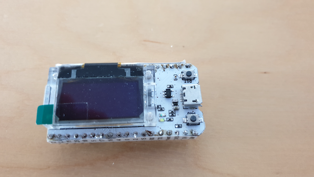
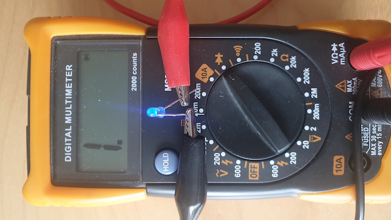
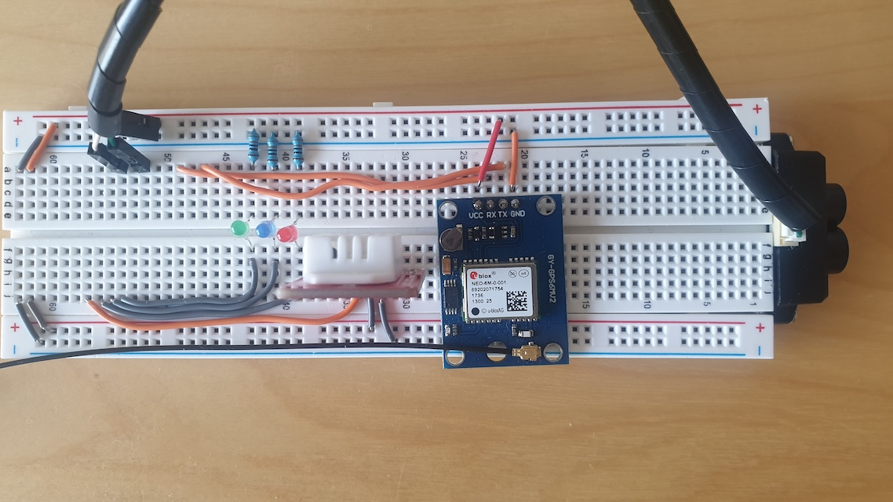
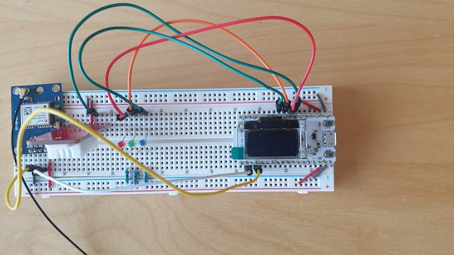
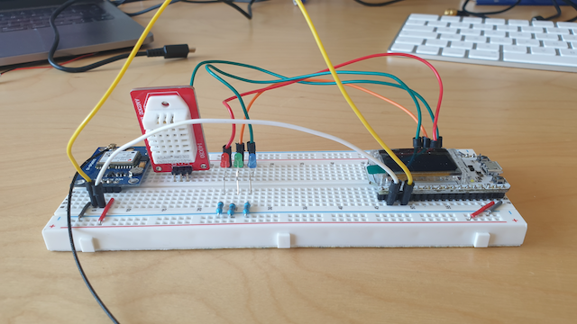
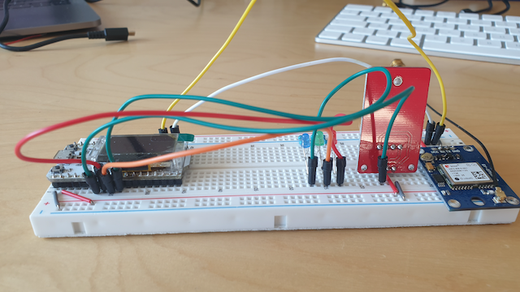
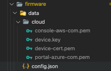
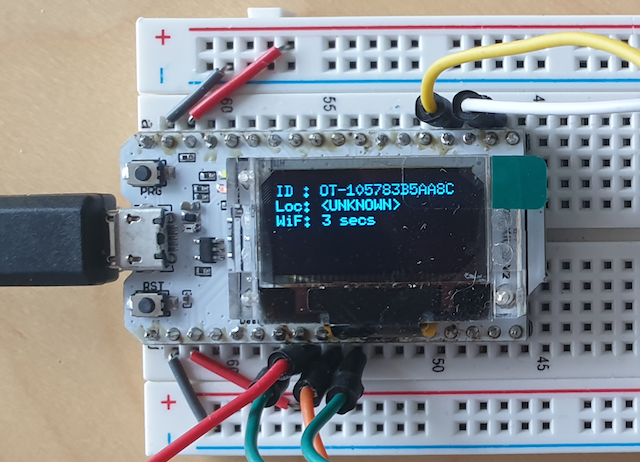

# ESP-32 Journey To The Cloud

Its ok to create software that runs on an ESP32, get to collect data, but if we don't do anything with that data its a bit pointless.  With that in mind and the fact any of the [Azure](https://azure.microsoft.com/en-us/) tutorials I can find only support STS tokens, and not x509 certificates I decided to write this. Something I have been wondering over the last few  years and never got around to prove if it could work was if I put an x509 certificate on a device could I get it to connect to both [AWS](https://aws.amazon.com/) and [Azure](https://azure.microsoft.com/en-us/), but not at the same time.  This article will show you it is possible, but there are a few hurdles to jump over, like the Azure SDK kit for embedded devices does not support x509 certificates!  Well you maybe able to, but you have to use [ESP-IDF](https://docs.espressif.com/projects/esp-idf/en/latest/esp32/) and the latest Azure SDK developed by [ESPRESSIF](https://www.espressif.com/) for Microsoft.  I have not tried it, as I wanted to use [Arduino](https://www.arduino.cc/).  

> **Why NOT Google Cloud Platform (GCP)**
>
> I will not cover Google Cloud Platform, as it currently stands.  I believe it is currently not fully featured enough yet.  I expect it to be in the next year, if Google don't do their normal, `its not making money so lets kill it` mind set.  GCP has survived a few years now so it just may succeed, also last year it seemed they have given up to compete with AWS as a IAAS platform and gone their own way.  Which I am really glad about.  We don't need another AWS look-a-like, but something different.  Multi-cloud is an option some companies need, and we could now have a 3rd global player.

As the old saying goes a *journey of a 1000 steps begins with the 1st step*, so lets start.

I have made public the source code and documentations in a git hub repository which you can find at [https://github.com/gbd77rc/esp32-iot-x509.git](https://github.com/gbd77rc/esp32-iot-x509.git).  This repository was originally just going to be for x509 article, but I will be extending it.

There are many short tutorial out in the internet, but nothing to really show a journey on how to get a device securely connected to the cloud and visualise the data.  This article will cover how to do device development, cloud registration and ingestion of data.  I will try to keep the costs of the cloud down to the minimum by using the free tier where I can or showing you how to quickly undeploy if not.

Throughout this journey I will introduce some TLA.  Most of the meanings below I accquired from Wikipedia.  

| Terminology | Meaning                                                      |
| ----------- | ------------------------------------------------------------ |
| **CA**      | **Certificate Authority** - in simplist terms, a **CA** is an entity that issues digital **certificates** |
| CSR         | **Certificate Signing Request** - the request need to help generate a certificate |
| **JITR**    | **Just In Time Registration** - is the ability to allow devices to automatically register with a cloud provider when they first switch on and have access to the internet. |
| **OTA**     | **Over The Air** - is the process where the firmware/configuration can be remotely updated/replaced. |
| **SOC**     | **System On a Chip** - is an integrated circuit (also known as a "**chip**") that integrates all or most components of a computer or other electronic **system** |
| **TLA**     | **Three Letter Acronym** - way of making a phrase with two or more words shorter by only using the first letters of the words: Three letter acronyms are very common in the world of computers! |
|             |                                                              |
|             |                                                              |
|             |                                                              |

## The Device

The device we are developing will contain the following telemetry data points.

- Temperature/Humidity Detecting using DHT-22 sensor
- GPS for outdoor positioning
- Connected WiFi signal strength detection

> A follow on article will cover how to use WiFi signal strength of nearby routers and a bit of maths to workout the devices indoor location.  It will also cover how to apply this new feature to the device using OTA.  I will also cover JITR as well.

Why multiple different sensors?  Good question, and the answer is that I want to show how to use tasks within Arduino that can run at different times and on different core as the ESP32 dual core SOC.

The device will make use of Shadow/Device Twin features for configuration and telemetry data and standard topic for telemetry data.  There is an issue with Azure Device Twin in that it does not support JSON arrays, so if you want to send GeoJson data you have to use standard topics.

> The device could have used standard topics for control messages, but I wanted to show off these extra cloud features. 

We are going to create the device from the following components.  Links will redirect you to Amazon website for the UK.  You will have to change to your own Amazon region or use related website for the components.  

- ESP32 Module OLED Display WiFi Development Board [https://www.amazon.co.uk/gp/product/B076P8GRWV](https://www.amazon.co.uk/gp/product/B076P8GRWV)
- GPS NEO-6M [https://www.amazon.co.uk/gp/product/B0783H7BLW](https://www.amazon.co.uk/gp/product/B0783H7BLW)
- U.FL Mini PCI to SMA Female [https://www.amazon.co.uk/gp/product/B01LPXGJ2I](https://www.amazon.co.uk/gp/product/B01LPXGJ2I)
- GPS External Ariel SMA [https://www.amazon.co.uk/gp/product/B00LXRQY9A](https://www.amazon.co.uk/gp/product/B00LXRQY9A)
- DSD Tech DHT22 [https://www.amazon.co.uk/gp/product/B07CM2VLBK](https://www.amazon.co.uk/gp/product/B07CM2VLBK)

Now I also used a breadboard to hold the components and use 3 LED's to show status.  I have not included links as I am sure you can source them yourselfs.

The **GPS External Ariel** and **U.FL Mini PCI to SMA** are really only needed if you want to program the device inside a warm environment or not.  I know you can sometimes get a satellite lock indoors, but its not reliable as you need line of sight for the lock.

### ESP32 Soc

This board has some nice features, like inbuilt WiFi controller, 8MB of flash storage, low power draw when in deep sleep (800uA) to name a few.  The is a different version of the board that support LoRAN communication as well.  If I have time at the end I will try to incorporate that version with this setup.

#### Multiple Threads aka Task

The ESP32 device has 2 cores, this allows for multiple processes/tasks to be performed at once.  The timing is an issue here with the possible race conditions that could follow, like reading of pins that share the same hardware interrupts. With that being said some of tasks will take Mutex before beginning checking the sensor and then hand back the Mutex when finished.  This should stop any race condition.

Not all tasks will require to be ran on core 0 either.  We will see what the balance is like during the development.  Currently thinking that the check for cloud messages can be ran on the core 1, along with the other standard functions for display and loop functions.  Arduino uses core 1 for its `setup` and `loop` functions by default.

### Power Sources

So how are we going to power it?  Good question.  When you program the device it will get power from the USB port, but if you want to use it in isolation then you need an external power source.  

The EPS32 Development board accepts 5v via the USB connector, but the battery connector underneath only seems to accept the 3.7v from the Lithium battery.  So when connected the 5v pin only reads 1.4v. This is a problem in that the GPS needs between 3.3v and 5v, closer to 5v the better to get a satellite fix.  I have tried a step up DC to DC regulator and made sure the output voltage was 5.1v but the 5v pin still reads 1.4v.

The ESP32 board has an onboard voltage regulator, so we don't need to worry about frying the ESP32 chip itself and I think this is where we run into difficulties.  Still waiting for information from the manufacturer about the 3.3v and 5v power pins and acceptable power inputs.  On a side note, the power pins do not switch off when you tell the ESP32 chip to go to deep sleep mode. 

### Building The Device

I have already pre-soldered ESP32 Development board.  From the photos you can see I am not that good at soldering.



The following circuit diagram will help with the connecting of pins.


#### Testing LED

The LED has a negative and positive leg.  Its important that you get them the right way around or else at best it does not light up or worst you will blow it.  Not seen them blown up with these types of setups, but if you apply enough voltage they can. Generally the short leg is the negative and the long leg is positive.  If you have cut the legs to fit a circuit, how can you tell.  The best way I have found is using a multimeter. They generally have a diode tester option, well thats what I call it, I bet someone will correct me here.



Connect the negative and positive probes and the LED should light up.  Switch the probes around if not.  Now you know which side is the negative.

> On a side note, you need to use a resistor to limit the current being used on the ESP32 pins.   I am using a 330ohms resistor  for each LED.  This may not be correct value, depending on the LED colour, but should not cause any real problem.  The main problem will be that the LED will not be bright as it could be.   They are connected from GPIO pin to LED to Resistor to GND pin.

#### Wiring Up Device

Now using a breadboard, I have added pre-cut wires and sensors to it.  These can be sourced from Amazon as well. 



Now press in the ESP32 WiFi board into the breadboard.  Be very careful here, as pressing down too hard on the display edge will break it.  I have done this once!







Once the external ariel is connected and end of the GPS Antenna is placed outside, or has a direct line of sight to the sky, you are ready to power it.  Make sure if you have double glazing, this can cause interference as well, open up the window if you can.  The GPS red led (satellite fix) will start to flash any where between 5 seconds to a minute after power is applied.  If you leave it powered it should come alive.  If after 5 minutes nothing is seen, either the antenna does not have line of sight to the satellites or you don't have enough power to the GPS, or it is broken.  Those are generally the only reasons it will not work.  Now getting something sensible from it is a different story.  As long as the `RX` and `TX` pins are connected correctly the ESP 32 should be able communicate with it.

## Firmware Development

I will not be going thought the firmware line by line as that will be boring.  I will leave it up to you to decide if you wish to do that.  Instead I will go explain about each library and what to look out for. 

### IDE Platform

The recommended IDE from Platform.io is to use Visual Studio Code ([https://code.visualstudio.com/download](https://code.visualstudio.com/download)) and use the Platform.io extension.  This can be found in the extension market place ([https://marketplace.visualstudio.com/items?itemName=platformio.platformio-ide](https://marketplace.visualstudio.com/items?itemName=platformio.platformio-ide)).  Personally I have a lot more extensions added for cloud interaction, formatting, docker/containers etc.  This is a great open source IDE.  It can be a bit limiting sometimes, depends on the language you are using  like Java.

With the `PlatformIO` extension install you should see the following navigation icon in the `Activity Bar`  


When selected you should see the following in the `Sidebar`.


The important options are as follows.

| Option                   | Meaning                                                      |
| ------------------------ | ------------------------------------------------------------ |
| Build                    | Used to test compilation locally really.                     |
| Upload                   | Used to flash the device of the compiled code.  It will detect if needs compilation again if required. |
| Monitor                  | Use to monitor the Serial communication that the device uses.  See `Logging` library for details.  By the time the monitor is connected the device may have been running for a few seconds, just press the reset button to see the log from the start. |
| Upload File System Image | This will load on the flash all the files and folder in the data folder.<br /><br /><br />See the SPIFF [https://docs.espressif.com/projects/esp-idf/en/latest/esp32/api-reference/storage/spiffs.html](https://docs.espressif.com/projects/esp-idf/en/latest/esp32/api-reference/storage/spiffs.html) documentation on how to read/write files from the device.  This is required whenever the `config.json` or replacement certificates are changed.  As the PlatformIO system knows where the folder is, it will upload the image to device. |

Along with the IDE you will need the following cloud provided command line tools.

- Azure Cli installation instructions ([https://docs.microsoft.com/en-us/cli/azure/install-azure-cli?view=azure-cli-latest](https://docs.microsoft.com/en-us/cli/azure/install-azure-cli?view=azure-cli-latest)).  
- AWS Cli installation instructions ([https://docs.aws.amazon.com/cli/latest/userguide/install-cliv2.html](https://docs.aws.amazon.com/cli/latest/userguide/install-cliv2.html)).

### Programming Language

The firmware is going to be written in C/C++ version 11, so we are not going to be using any of the fancy features that 14 and 17 give.  That being said, we don't really need them.

### Platformio.ini File

If you open up the `platformio.ini` file in the root of the github repo you will notice this section.

```ini
[platformio]
data_dir = firmware/data
src_dir = firmware/src
include_dir = firmware/include
lib_dir = firmware/lib
```

Normally, this would not be included.  As I will be including multiple different projects in this repo, generally you keep them all self contained, I have add it in.  

I have added in following to the project section of the `platform.ini` file.

```ini
upload_port = /dev/cu.SLAB_USBtoUART
monitor_port = /dev/cu.SLAB_USBtoUART
```

This is because I have multiple USB ports on my Mac and don't want to have to specify which port to use when I upload to the device or use the monitoring tool.  You can either remove these entries or update them to your USB port identifier.  

> I have noticed on Windows platform the COM port identifier increments if it things the port is in use between uploads at random times.  This may have been a quirk on my system.

### Libraries

The firmware will use a mix of libraries from 3rd party or ones we will make.    All 3rd party libraries are registered in the `platformio.ini` file, in the `lib_deps` setting.

All developed libraries are in the `lib` folder.  By the time this published you should find the following in each sub folder.  The `.cpp` and `.h` files that contain the library and a `readme.md` that will explain it.

#### Configuration

This library will have two classes defined in it. The `BaseConfigInfoClass` is really just an interface that each class the needs to handle configuration must inherit from.  The `ConfigClass` handles the actual loading/saving of the configuration file and the logic around when to save.  We don't want to save always, as their is limit on the number times the flash memory can be written to.

The `ConfigClass` does make uses of the `LogInfoClass`, so you may think there is race/deadlock condition here, as logging requires configuration.  It does not, as it just sets the level that the log messages are sent to the serial port and nothing else.

The single instance name is `Configuration`.

> ***3rd Party ArduinoJson Library***
>
> The configuration library depends heavily on the ArduinoJSON ([https://arduinojson.org/](https://arduinojson.org/)) v6 library for handling of the JSON file.  I would recommended at least reading their `common errors and problems section`.  T

#### Logging

The logging library uses the configuration to determine which level it will report on.  The single instance name is `LogInfo`.  Why LogInfo, basically because there is another 3rd party library that uses `Logging` as their instance name, so to avoid conflicts I renamed mine.

Example of Logging Output

```shell
398:VRB:1:CPU Id is 105783B5AA8C
```

- ***398:*** - is the milliseconds since start of the device
- ***VRB:*** - is the log level
- ***1:*** - is the core ID that the log was created on  
- ***CPU Id is 105783B5AA8C*** - is the actual message 

#### LED Control

 There are 3 LED's to control.  These will give out state to the local environment, if someone is watching that it.  The following states are.

| Colour       | State    | Meaning                                                      |
| ------------ | -------- | ------------------------------------------------------------ |
| RED (Power)  | Blinking | Initialising the device                                      |
| RED          | Steady   | Working normally                                             |
| RED          | Off      | Deep Sleep Mode or Powered Off                               |
| Green (WiFi) | Blinking | Trying to connect to WiFi router                             |
| Green        | Steady   | Connected to the internet                                    |
| Green        | Off      | If Power is on and stready, then cannt connect to WiFi or no internet. |
| Blue (Cloud) | Blinking | Trying to connect to the cloud provider or is sending/recieving data |
| Blue         | Steady   | Successfully connected to the cloud                          |
| Blue         | Off      | Cannot connect to the cloud, waiting for reboot to try again |

The blinking state will be handle by a separate task. This task will check a state flag, and if set will automatically set the LED on/off depending on the state flag and then delete itself. 

This library relies on the ESP32 analogWrite ([https://github.com/ERROPiX/ESP32_AnalogWrite](https://github.com/ERROPiX/ESP32_AnalogWrite)) library as ESP32 does not support support the standard Arduino analogWrite function.  This allows to write a percentage value for the brightness (0 to 100%) instead of the digital 0 for off or 1for fully on.

> Interesting this library uses Task Notification functions ([https://docs.espressif.com/projects/esp-idf/en/latest/esp32/api-reference/system/freertos.html#_CPPv411xTaskNotify12TaskHandle_t8uint32_t13eNotifyAction](https://docs.espressif.com/projects/esp-idf/en/latest/esp32/api-reference/system/freertos.html#_CPPv411xTaskNotify12TaskHandle_t8uint32_t13eNotifyAction)) to control blinking on or off. 

The single instance name is `LedInfo`.

#### Device Information

This library is a catch all one, in that it contains the actual full ID, location and wake up details at least.  During the development if other options that are specific to the device they may appear here.

The single instance name is `DeviceInfo`.

#### Display Information

This library will control and printout information to the embedded OLED display.  It is a wrapper for the U8g2 ([https://github.com/olikraus/U8g2_Arduino](https://github.com/olikraus/U8g2_Arduino)) library which knows how to communicate with the display.

The single instance name is `OledDisplay`.

#### Environment Sensor

This library will handle environment sensor reading.  It will wrap the SimpleDHT ([https://github.com/winlinvip/SimpleDHT](https://github.com/winlinvip/SimpleDHT?utm_source=platformio&utm_medium=piohome)) library.  It will make sure the reading of the sensor is done on core 0.

The single instance name is `EnvSensor`.

#### GPS Sensor

This library will handle GPS sensor reading.  It will wrap the TinyGPSPlus ([https://github.com/mikalhart/TinyGPSPlus](https://github.com/mikalhart/TinyGPSPlus)) library for translating the data recieved on the Serial Port 2.  It will make sure the reading of the sensor is done on core 0.

The single instance name is `GpsSensor`.

#### WiFi Information

This library will control how the ESP32 will connect to the internet.    The single instance name is `WiFiInfo`.

The device will automatically switch to WPS mode under the following conditions.

1. Never linked to a router before
2. Cannot find previous router
3. Cannot connect in a timely manner to an existing router



It will display give a count of seconds it has waited for, it only give this count if waiting for WPS mode.  The user will then be able to press the routers WPS button and reset the ESP32 to try again.  During testing I have noticed it asks for WPS 1 in every 10 resets.  I had to just reset it again to connect automatically.  

> I leave it up to the reader to add the code to automatically reset if it detects that the router's SSID is detected and within range (DB Strength).

#### NTP Information

This library will handle the date/time from the internet.  Basically the ESP32 does not have an onboard clock/battery for the time/date.  It does record the processor tick count since powering on.  It will wrap the NTP Client ([https://github.com/arduino-libraries/NTPClient](https://github.com/arduino-libraries/NTPClient)) library.  It adds in the extra functions for formatting date/time that the standard library does not support.

The single instance name is `NTPInfo`.

#### Wakeup Information

This library will handle when to sleep and when to wake up.  It wraps the ESP Sleep Modes ([https://docs.espressif.com/projects/esp-idf/en/latest/esp32/api-reference/system/sleep_modes.html](https://docs.espressif.com/projects/esp-idf/en/latest/esp32/api-reference/system/sleep_modes.html)).  We will go into deep sleep mode.  

How long to sleep for and when to sleep is controlled via configuration.

The single instance name is `WakeUp`.

#### Cloud Information

This device is useless unless it can connect to the cloud and report on it sensors. The library has both Azure and AWS implementations, they share a common configuration `CloudInfo` and a common base class `BaseCloudProvider`.  Most of the code to do the actual publish/subscribe and connecting is handle by the base class.  The individual instances handle the topic and server configuration related data.

The single instance name is `CloudInfo`.

### Device Configuration

The following information describes the configuration file layout and how it related to the device.

```JSON
{
        "logInfo": {
            "level": "ALL"
        },
        "ledInfo": {
            "brightness": 100,
            "cloud": 25,
            "wifi": 26,
            "power": 27
        },
        "gpsSensor": {
            "enabled": true,
            "tx": 23,
            "rx": 22,
            "baud": 9600,
            "sampleRate": 1000
        },
        "envSensor": {
            "enabled": true,
            "data": 14,
            "scale": 1,
            "sampleRate": 20000
        },
        "device": {
            "prefix": "OT",
            "wakeup": 1200,
            "sleep": 60,
            "location": "<UNKNOWN>"
        },
        "cloud": {
            "provider": "azure",
            "certs": {
                "certificate": "/cloud/device-cert.pem",
                "key": "/cloud/device.key"
            },
            "iotHub": {
                "endpoint": "",
                "port": 8883,
                "sendTelemetry": true,
                "sendDeviceTwin": true,
                "intervalSeconds": 45
            },
            "azure": {
                "ca": "/cloud/portal-azure-com.pem"
            },
            "aws": {
                "ca": "/cloud/console-aws-com.pem"
            }
        }
    }
```

#### Log Info Element

Internally the device will echo various log messages to the Serial Port 1.  The level that will be logged to this port are:

0. Off
1. Error
2. Warning
3. Information
4. Verbose
5. All

Using the level will determine which message types are echoed.  Example if the level is set to Warning, then only Error and Warning messages will be sent, but set to All, then all messages will be sent.

#### Led Info Element

The LED's will show the user what the device is doing or is active.  

| Name       | Default Value | Meaning                                                      | Could Be Cloud Updatable |
| ---------- | ------------- | ------------------------------------------------------------ | ------------------------ |
| brightness | 100           | How bright the LEDs will be.  It is a percentage value.  0 is off and 100 is fully bright. | Yes                      |
| cloud      | 25            | Pin number that the LED is connected to.                     | No                       |
| wifi       | 26            | Pin number that the LED is connected to.                     | No                       |
| power      | 27            | Pin number that the LED is connected to.                     | No                       |

#### GPS Sensor Element

The sensor will retrieve the latitude/longitude, altitude, direction, speed and how many satellites are locked data.  The configuration is for the pin numbers used to communicate with the GPS sensor.   As with all UART Protocol ([https://www.circuitbasics.com/basics-uart-communication/#:~:text=UART%20stands%20for%20Universal%20Asynchronous,transmit%20and%20receive%20serial%20data](https://www.circuitbasics.com/basics-uart-communication/#:~:text=UART%20stands%20for%20Universal%20Asynchronous,transmit%20and%20receive%20serial%20data).) devices the `RX` and `TX` get crossed over.

| Name       | Default Value | Meaning                                                      | Could Be Cloud Updatable |
| ---------- | ------------- | ------------------------------------------------------------ | ------------------------ |
| enabled    | true          | Is the GPS reading enabled or not                            | Yes                      |
| tx         | 23            | Transmission Pin                                             | No                       |
| rx         | 22            | Receiving Pin                                                | No                       |
| baud       | 9600          | The speed at which the GPS will transmit its information to the device.  Some of the GPS sensors you change this, the NEO-6M can be changed, but I have left it at the default. | Yes                      |
| sampleRate | 5000          | How many milliseconds to wait between reading of the GPS     | Yes                      |

#### Env Sensor Element

The sensor will retrieve the current temperature and humidity.  The sensor being used for this is the DHT-22, which has a bigger range and is more sensitive.  

> Temperature Range: -40 to 80 °C +/- 5°C
>
> Humidity Range: 0 - 100% +/- 2.5%

| Name       | Default Value | Meaning                                                      | Could Be Cloud Updatable |
| ---------- | ------------- | ------------------------------------------------------------ | ------------------------ |
| enabled    | true          | Is the Env Sensor reading enabled or not                     | Yes                      |
| data       | 14            | The pin the data is read from                                | No                       |
| scale      | 1             | The temperate scale to display the information in.<br /><br />Celsius = 1<br />Kelvin = 2<br />Fahrenheit = 3 | Yes                      |
| sampleRate | 20000         | How many milliseconds to wait between reading of the Env Sensor.  There is a minimum sample rate of 0.5Hz for DHT22 sensor (about 2.5 seconds). | Yes                      |

#### Device Info Element

This is the ESP32 device related information.  

| Name     | Default Value | Meaning                                                      | Could Be Cloud Updatable |
| -------- | ------------- | ------------------------------------------------------------ | ------------------------ |
| prefix   | OT            | Prefixes the CPU ID, to give it a more identifiable ID. Its short here so that it will fit on the OLED display, but can be any length.  Not settable via the cloud, as it will make up the device ID which is `common name` in the x509 certificate on the device.  The cloud provides a check that the CN is the same as the device ID when connecting. | No                       |
| wakeup   | 1200          | How many seconds to sleep before waking up.                  | Yes                      |
| sleep    | 60            | Miniumum amount of seconds to stay awake before going into deep sleep mode.  The time to initialise and send data out is at minimum of 25 seconds. | Yes                      |
| location | \<UNKNOWN\>   | This is a friendly name of the location where the device is installed. | Yes                      |

#### Cloud Info Element

This element controls how the device will connect to the cloud.  

| Name     | Default Value | Meaning                                                      | Could Be Cloud Updatable |
| -------- | ------------- | ------------------------------------------------------------ | ------------------------ |
| provider | azure         | Which cloud are we connecting to.  Only `azure` and `aws` are currently value. | No                       |
| certs    |               | This element contains the actual devices certificate  and key | No                       |
| iotHub   |               | This element contains the information what the cloud provide MQTT endpoints are. | No                       |
| azure    |               | This element contains the public key for Azure IoT Hub       | No                       |
| aws      |               | This element contains the public key for AWS IoT Core        | No                       |

##### Certs Element

| Name       | Default Value          | Meaning                                                      | Could Be Cloud Updatable |
| ---------- | ---------------------- | ------------------------------------------------------------ | ------------------------ |
| certifiate | /cloud/device-cert.pem | The file that contains the `CN` of the device.               | No                       |
| key        | /cloud/device.key      | The private key that will encrypt the communication between the device and the cloud provider.  The cloud provider will have the public key to decrypt this information. | No                       |

##### IotHub Element

| Name            | Default Value | Meaning                                                      | Could Be Cloud Updatable |
| --------------- | ------------- | ------------------------------------------------------------ | ------------------------ |
| endpoint        |               | The actual endpoint to the MQTT broker                       | No                       |
| port            | 8883          | The port number the MQTT broker is listening on.  I would use this one instead of 443 as it requires the cert to contain extra information before it iis allowed to connect. | No                       |
| sendTelemetry   | true          | Should the device send data to the telemetry topic           | Yes                      |
| sendDeviceTwin  | True          | Should the device send data to the shadow/device twin topic  | Yes                      |
| intervalSeconds | 45            | How many seconds to wait before sending another message      | Yes                      |

##### Azure Element

This is the public key that the cloud provider gives out for decryption of information from them and is included in the repository.  The expiry is 12th May 2025.

The actual public key is pretty hard to find.  The entire cert is embedded in Azure-IoT-SDK-C certs.c ([https://github.com/Azure/azure-iot-sdk-c/blob/master/certs/certs.c](https://github.com/Azure/azure-iot-sdk-c/blob/master/certs/certs.c)) file.  Also the documentation in iot-hub-mqtt-support.md ([https://github.com/MicrosoftDocs/azure-docs/blob/master/articles/iot-hub/iot-hub-mqtt-support.md](https://github.com/MicrosoftDocs/azure-docs/blob/master/articles/iot-hub/iot-hub-mqtt-support.md)) contains information about it.  Thats about the only places I have seen so far.

##### Aws Element

This is the public key that the cloud provider gives out for decryption of information from them and is included in the repository.  The expiry is 17th Jan 2038.

Unlike Azure the AWS root certificate has a handy link to download from [https://www.amazontrust.com/repository/AmazonRootCA1.pem](https://www.amazontrust.com/repository/AmazonRootCA1.pem).  I have downloaded the RSA 2048 Bit key and not the legacy one.  The information around this can be location in the Server Authentication ([https://docs.aws.amazon.com/iot/latest/developerguide/server-authentication.html](https://docs.aws.amazon.com/iot/latest/developerguide/server-authentication.html)) documents in the AWS IoT Developer Guide.

### Device Certificate

Each device should have its own certificate with its `Common Name` set to the device identifier.  There are two sides to secure communication, this article shows how to create the certificates that the device will use to encrypt the data and how the cloud side will decrypt the data.  So that the device knowns how to read the data coming from the cloud we will need a public cert/key to do the decryption.

#### Device Id aka Common Name

So the first step is to work out the device identifier.  If we where the manufacturer, then this would be part of the automatic certificate creation process when the device is produced.  As we are not, then the quick way is to flash the following code to the ESP32 development board.

```C++
#include <Arduino.h>
#include <SPIFFS.h>
#include "LogInfo.h"
#include "Display.h"

void setup()
{
    Serial.begin(115200);
    LogInfo.begin();
    OledDisplay.begin();  
    LogInfo.log(LOG_VERBOSE, "CPU Id is %s", LogInfo.getUniqueId());
    OledDisplay.displayLine(0, 10, "ID : %s", LogInfo.getUniqueId());
}

void loop(){}
```

This is done by replacing the connects of `firmware/src/main.cpp`file with the above.  Don't worry we have not lost the contents if you clone the repository.  Just revert the changes.

One you have update the `main.cpp` click on the `Platformio` menu item and select `Upload`.  It should then build the source files and upload the binary to the ESP32 development board.


The OLED display should show


As the `prefix` in the configuration is `OT`  and the CPU Id is `105783B5AA8C` then the actual device Id will be `OT-105783B5AA8C`.

#### From Root Certificate to Device Certificate

We need a private CA to generate the device certificate and create a validation chain.  Normally you would have a signing certificate generated from a recognized CA like digicert ([https://www.digicert.com/](https://www.digicert.com/)).  

> I am not associated them, or have ever brought any certificates from them.

We don't want the expense, so will create our own and upload that to the cloud, which they allow.  To follow along then you need to make sure you have `openssl` application installed on your os.  I use a Mac OSX here, but it is available for Windows and Linux.  The command line may differ on Windows/Linux.  You will need to do some research on the command if it fails.

The `file names` and `CA Common Name` can be changed to suit your needs.  Just make them consistent.  

> ***IMPORTANT***
>
> Keep these files safe or you will not be able to generate other device certificates linked to the same CA certificate.

##### Mac OSX OpenSSL Workaround

If you are using a Mac OSX, then it is more then likely has LibraSSL installed.  It does not have the `-addext` option to the command.  Which is needed to add the `basicConstraints` properties to the root CA certificate.    To get around this do the following.

```shell
nano rootca.conf
```

Add this to the file.

```ini
[ req ]
distinguished_name       = req_distinguished_name
extensions               = v3_ca
req_extensions           = v3_ca

[ v3_ca ]
basicConstraints         = CA:TRUE

[ req_distinguished_name ]
countryName                     = Country Name (2 letter code)
countryName_min                 = 2
countryName_max                 = 2
0.organizationName              = Organization Name (eg, company)
organizationalUnitName          = Organizational Unit Name (eg, section)
commonName                      = Common Name (eg, fully qualified host name)
commonName_max                  = 64
```

This file does remove some of the fields that you normally see like the State and Email.

See the following [https://github.com/jetstack/cert-manager/issues/279](https://github.com/jetstack/cert-manager/issues/279) github issue, it will explain other ways around this as well.

#### Step 1 - Create the CA Certificate.

This is a 3 stage process, first create an unique private key.

```shell
▶ openssl genrsa -out dev-root-ca.key 4096
Generating RSA private key, 4096 bit long modulus
...............................................................................................++
...........................................++
e is 65537 (0x10001)
```

Then you need a certificate signing request (CSR) file.  The `Common Name` attribute should be some URI, it does not need to exist, but should be the same in both files. 

```shell
▶ openssl req -new -sha256 -key dev-root-ca.key -nodes -out dev-root-ca.csr -config rootca.conf
You are about to be asked to enter information that will be incorporated
into your certificate request.
What you are about to enter is what is called a Distinguished Name or a DN.
There are quite a few fields but you can leave some blank
For some fields there will be a default value,
If you enter '.', the field will be left blank.
-----
Country Name (2 letter code) []:GB
Organization Name (eg, company) []:
Organizational Unit Name (eg, section) []:
Common Name (eg, fully qualified host name) []:devices.abc.com
```

Finally you create the certificate from the `key` and `csr`.

```shell
▶ openssl req -x509 -new -in dev-root-ca.csr -key dev-root-ca.key -sha256 -days 365 -out dev-root-ca.pem -config rootca.conf -extensions v3_ca
You are about to be asked to enter information that will be incorporated
into your certificate request.
What you are about to enter is what is called a Distinguished Name or a DN.
There are quite a few fields but you can leave some blank
For some fields there will be a default value,
If you enter '.', the field will be left blank.
-----
Country Name (2 letter code) []:GB
Organization Name (eg, company) []:
Organizational Unit Name (eg, section) []:
Common Name (eg, fully qualified host name) []:devices.abc.com
```

I have limited to 365 days.

#### Step 2 - Create the Device Certificate

This is also a 3 stage process.  First create another unique private key.  These steps are repeated for every device you wish to connect to the cloud.

```shell
▶ openssl genrsa -out device.key 4096
Generating RSA private key, 4096 bit long modulus
........................................................................++
................................++
e is 65537 (0x10001)
```

As before, we need a `csr`.  Make sure the `Common Name` is set to the device ID.  I would make the output file name the cpu or device id.  This way multiple CSR/PEM files can be created in the same directory.

```shell
▶ openssl req -new -key device.key -out 105783B5AA8C.csr
You are about to be asked to enter information that will be incorporated
into your certificate request.
What you are about to enter is what is called a Distinguished Name or a DN.
There are quite a few fields but you can leave some blank
For some fields there will be a default value,
If you enter '.', the field will be left blank.
-----
Country Name (2 letter code) []:GB
State or Province Name (full name) []:
Locality Name (eg, city) []:
Organization Name (eg, company) []:
Organizational Unit Name (eg, section) []:
Common Name (eg, fully qualified host name) []:OT-105783B5AA8C
Email Address []:

Please enter the following 'extra' attributes
to be sent with your certificate request
A challenge password []:
```

You will notice that the `Common Name` now contains the device Id that we retrieved earlier.  You can add a password if you like.  Its more secure if you do.

Finally lets generate the x509 certificate that will be placed on the device.

```shell
▶ openssl x509 -req -in 105783B5AA8C.csr -CA dev-root-ca.pem -CAkey dev-root-ca.key \
-CAcreateserial -out 105783B5AA8C-cert.pem -sha256
Signature ok
subject=/C=GB/CN=OT-105783B5AA8C
Getting CA Private Key
```

#### Step 3 - Update The Device

Copy the `105783B5AA8C-cert.pem` and `device.key` to `<clone repo>/firmware/data/cloud` folder.  As the configuration is expecting `device-cert.pem` as the certificate file name I would rename it to that during the copy process.

```shell
▶ cp 105783B5AA8C-cert.pem <clone repo>/firmware/data/cloud/device-cert.pem
▶ cp device.key <clone repo>/firmware/data/cloud/device.key
```

Once this done you will need to `Upload File System Image` to the device.


#### Step 4 - Azure CA Registration

I am assuming you have already created an Azure Subscription.   To set the subscription in the command use the following.

```shell
▶ az account set --subscription "<subscription name>"
```

There can only be one free IoT Hub in a subscription, so if you already created one, either use that one or create a new one with S1 tier.  This will be about $25 per month at the time of writing this article.

So with that being said let create an IoT hub in the subscription selected.  The first step is to create a `Resource Group`.  You can apply subscriptions and RBAC to the resource group to control who has access etc.  Thats the short story, look at the various Azure documentation about them.

Resource groups need a default location where the resources are to be created.  I live the UK so I am going to use `ukwest` region code.

> `...` in the output signals that un-needed properties and values have been removed.

```shell
▶ az group create --name dev-ot-rg --location ukwest
▶ az iot hub create --name dev-ot-iot-hub --resource-group dev-ot-rg --sku S1
```

Now the output we are interested in is the `hostName` which you need to update the `endpoint` property in the `iotHub` element describe previousily.

```json
{- Finished ..
  ...
  "location": "ukwest",
  "name": "dev-ot-iot-hub",
  "properties": {
    ...
    "hostName": "dev-ot-iot-hub.azure-devices.net",
    ....
  },
  ...
  "type": "Microsoft.Devices/IotHubs"
}
```

Now we are ready to upload the CA certificate we create earlier.

```shell
▶ az iot hub certificate create --hub-name dev-ot-iot-hub --name dev-root-ca --path ./dev-root-ca.pem
```

There are 2 bits of information that are important from the output.

```json
{
  "etag": "AAAAAZDnDnY=",
  ...
  "name": "dev-root-ca",
  "properties": {
    ...
    "isVerified": false,
    ...
  },
  ...
  "type": "Microsoft.Devices/IotHubs/Certificates"
}
```

They are the `etag` and `isVerified`. To change the `isVerified` from false to true, the following will need to be done.  

```
▶ az iot hub certificate generate-verification-code --hub-name dev-ot-iot-hub --name dev-root-ca --etag AAAAAZDnDnY=
```

Notice the `etag` property on the command they must match the previous `etag` shown.  `etag` changes between updates.  There is only 1 important bit from the output and that is the `verificationCode`.

```json
{
  "etag": "AAAAAZDsxuE=",
  ...
  "name": "dev-root-ca",
  "properties": {
    ...
    "verificationCode": "92...81"
  },
	...
  "type": "Microsoft.Devices/IotHubs/Certificates"
}
```

The `verificationCode` is used as a `CN` for the certificate we are going to generate.  Make a note of the `etag` as well.

```shell
▶ openssl req -new -key dev-root-ca.key -out verification-azure.csr
You are about to be asked to enter information that will be incorporated
into your certificate request.
What you are about to enter is what is called a Distinguished Name or a DN.
There are quite a few fields but you can leave some blank
For some fields there will be a default value,
If you enter '.', the field will be left blank.
-----
Country Name (2 letter code) []:GB
State or Province Name (full name) []:
Locality Name (eg, city) []:
Organization Name (eg, company) []:
Organizational Unit Name (eg, section) []:
Common Name (eg, fully qualified host name) []:92...81
Email Address []:

Please enter the following 'extra' attributes
to be sent with your certificate request
A challenge password []:
```

Now we have `csr` lets generate the actual certificate

```shell
▶ openssl x509 -req -in verification-azure.csr -CA dev-root-ca.pem -CAkey dev-root-ca.key -CAcreateserial -out verification-azure.pem
Signature ok
subject=/C=GB/CN=92...81
Getting CA Private Key
```

The verification certificate is now ready to be upload to Azure.  Remember to replace the `etag` you received from the previous `az` command here.

```shell
az iot hub certificate verify --etag AAAAAZDsxuE= --hub-name dev-ot-iot-hub --path ./verification-azure.pem --name dev-root-ca
```

So now we can register the devices on Azure without needing to generated the primary/secondary tokens.  Just create the device with the device id as the name.  This will be covered in **Cloud Registration** section.

#### Step 5 - AWS CA Registration

Now we can do the same with AWS IoT Core as we did with Azure.  There is no real concept of a resource group, but you can tag resources to group them.  There is one IoT Core per region per account.   Now we will use the UK region, London is actually `eu-west-2` so that the region code we will use.  Unlike Azure we can create a registration/verification code before upload the CA certificate.  This code does not change for the account, unlike the Azure code.


### Cloud Registration